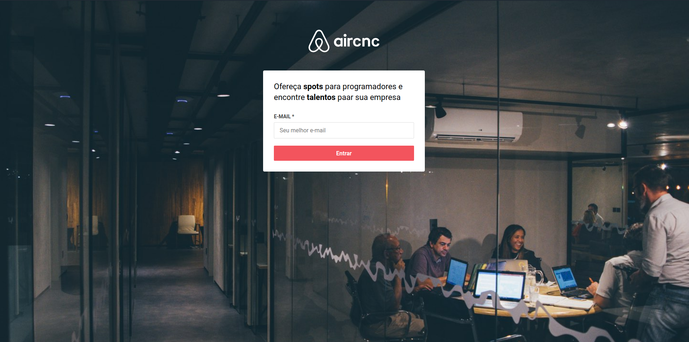
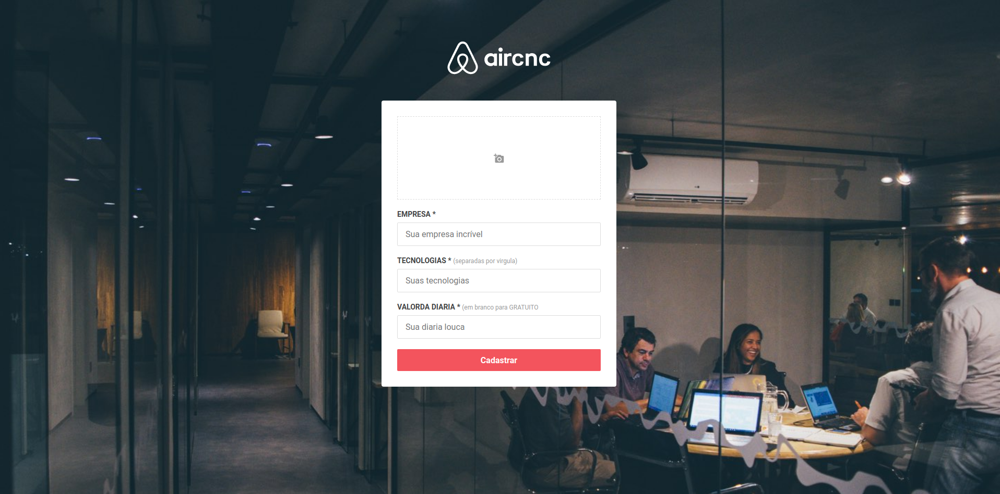
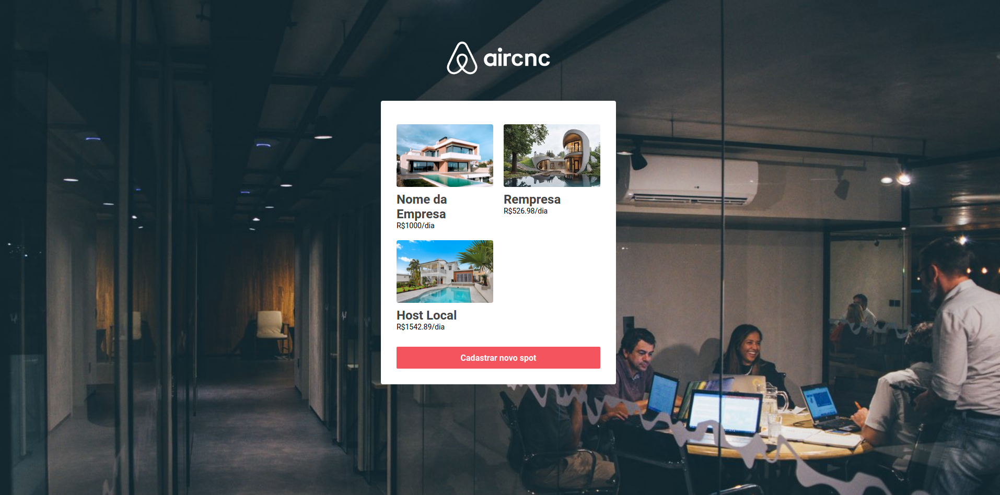
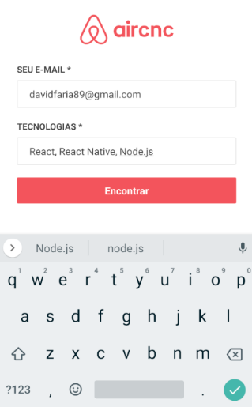
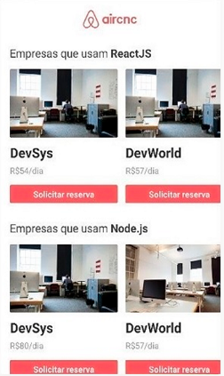

<h3 align="center">
    
</h3>

<p align="center">
  <a href="https://rocketseat.com.br">
    
  </a>
  <a href="https://rocketseat.com.br">
    
  </a>
   <a href="https://github.com/VictorGabrielMS">
    
  </a>
</p>


<p align="center">
  <a href="https://developer.mozilla.org/pt-BR/docs/Web/JavaScript">
    
  </a>
  <a href="https://nodejs.org/en/">
    
  </a>
  <a href="https://pt-br.reactjs.org/">
    
  </a>
  <a href="https://reactnative.dev/">
    
  </a>
</p>


## 

- [Sobre](#sobre)
- [A aplicação](#aplicacao)
- [Tecnologias utilizadas](#tecnologias-utilizadas)
- [Faça um clone e use](#como-usar)
- [Como contribuir](#como-contribuir)

<a id="sobre"></a>

## :interrobang:  Sobre

O <strong>Aircnc</strong> é uma aplicação Web e Mobile para os dev de plantão encontrarem seus hotspots!

Essa aplicação foi construída na semana <strong>Omnistack</strong>  disponibilizada pela [Rocketseat](https://rocketseat.com.br/). Essa aplicação vem com a ideia de criar um ambiente onde Empresas possam oferecer locais para programadores autonomos trabalharem e de quebra conhecerem o ambito empresarial.


<a id="aplicacao"></a>

## :sparkles:  A Aplicação

#### :computer:  Aplicação Web:

<h1 align="center">
    
    
    
</h1>

<br>

#### :iphone:  Aplicação Mobile:

<h1 align="center">
    
    
</h1>

<a id="tecnologias-utilizadas"></a>

## :diamonds:  Tecnologias utilizadas

O projeto foi desenvolvido utilizando as seguintes tecnologias:

- [Node.js](https://nodejs.org/en/)
- [React.js](https://reactjs.org/)
- [React Native com Expo](https://expo.io/)


<a id="como-usar"></a>

## :octocat:Clone este repositório

1. Faça um clone :

```sh
  $ git clone https://github.com/victorgabrielms/aircnc.git
```

2. Executando as aplicações:

```sh
  # API
  $ cd server
  $ npm install
  $ npm run dev
```
```sh
  # WEB
  $ cd web
  $ npm install
  $ npm run start
```

```sh
  # MOBILE
  $ cd mobile
  $ npm install
  $ npm run start
```

<a id="como-contribuir"></a>

## :dart: Como contribuir

- Faça um _Fork_ deste repositório;
- Crie uma _branch_ com a sua feature: `git checkout -b my-feature`
- _Commit_ suas mudanças: `git commit -m 'feat: My new feature'`
- Faça um _push_ da sua branch: `git push origin my-feature`

## :mortar_board: Omnistack Week


